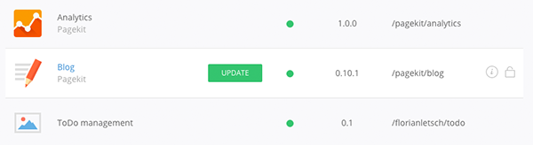
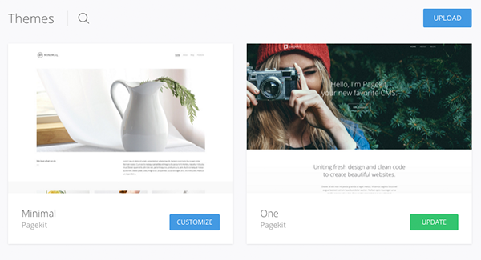

# Updating

Before you perform an update of Pagekit or an installed package, make sure you have a backup of your files and the database. That way you can always recover previous states of your installation in case something goes wrong.

## Update Pagekit

The recommended way of updating Pagekit is through its admin panel. Open _System > Update_ and click the _Update_ button. To verify that the update was successful, open _System > Info_. If everything went smoothly, you should see the new version number under the _System_ tab.

**Note** The update API is currently in development. Until it is available at [ttags.de](https://ttags.de), use manual updates as described below.

**Note** It is possible to update Pagekit manually. [Download](https://github.com/Shadesman5/pagekit/releases) the latest release from [GitHub](https://github.com/Shadesman5/pagekit) and extract the archive. Then upload the folder to your webserver and overwrite the existing files in the Pagekit folder. Run `composer install` and `yarn install && yarn compile-js --mode=production && yarn compile-less` to update dependencies and frontend assets. A database migration (if present) is triggered after logging in to the admin panel.

## Update Extensions and Themes

Extensions and themes target **PHP 8.2+** and **Symfony 6.4** and integrate via PSR-11 services, PHP 8 attributes for routing and ORM, and Doctrine Migrations 3.x for schema changes — see the [developer chapters](../developer/application.md) for details.

Extensions and themes can be updated from the System settings in the Pagekit admin panel. Navigate to _System > Extensions_ to see your installed extensions or navigate to _System > Themes_ to see the themes which are currently installed.

If an item has an update available, you will see a green _Update_ button next to the item in the list. Simply click this button to install the update.

**Note** The marketplace and package update API are in development. Until they are available, extension and theme updates may need to be performed manually (e.g. via Composer or by replacing package files).

For extensions, you will find the _Update_ button next to the extension name.

For themes, you will find the _Update_ button in the bottom right corner below the theme thumbnail.

